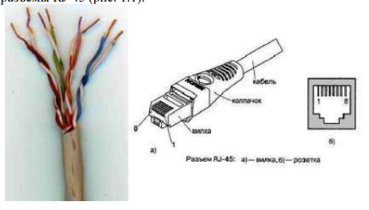
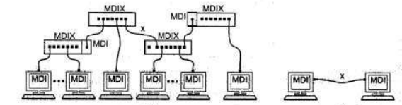
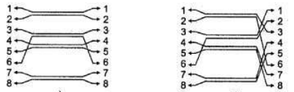
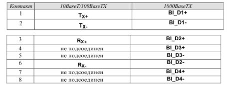
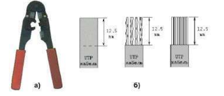
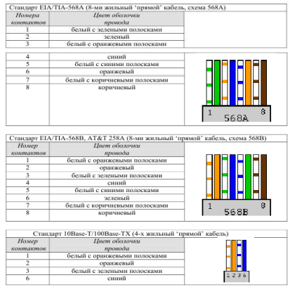
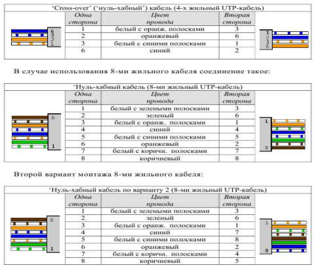
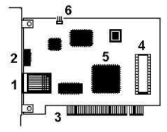
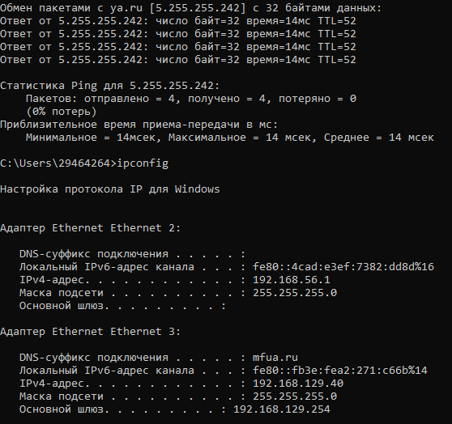

# Лабораторная работа №1 «Подключение персонального компьютера к локальной вычислительной сети» 

Цель работы: приобретение практических знаний и навыков в выборе и
установке сетевых адаптеров, монтажу и разделке сетевого кабеля, физическому присоединению ЭВМ к кабельной системе при создании локальной
компьютерной сети по технологии Ethernet.

Материалы, оборудование, программное обеспечение: IBM PCсовместимый персональный компьютер, сетевая карта (для шины данных PCI)
производительностью 10-100 Mbit/сек с разъемом RJ-45, кабель UTP категории 5, вилки RJ-45, обжимной инструмент.

# Теоретическое введение

Сетевой стандарт Ethernet был разработан в 1975-х г. в исследовательском центре корпорации Xerox, после чего доработан совместно DEC, Intel и XEROX (отсюда сокращение DIX) и впервые опубликован как 'Blue Book Standart' для Ethernet I в 1980 г. Этот стандарт получил дальнейшее развитие и в 1985 г. вышел новый - Ethernet II (известный также как DIX).
На основе стандарта Ethernet DIX был разработан стандарт IEEE 802.3, одобренный в 1985 году для стандартизации комитетом по LAN IEEE (Institute
of Electrical and Electronics Engineers). В зависимости от вида физической среды передачи данных стандарт IEEE 802.3 имеет модификации (число 10 в начале каждой обозначает скорость передачи данных 10 Мбит/сек):
• 10Base-5 (применяется коаксиальный кабель диаметром 0,5 дюйма - т.н.
толстый коаксиал с волновым сопротивлением 50 ом; максимальная длина
сегмента сети без повторителей 500 м, считается бесперспективным).
• 10Base-2 (коаксиальный кабель диаметром 0,25 дюйма - т.н. тонкий
коаксиал, волновое сопротивление 50 ом; максимальная длина сегмента сети
без повторителей 185 м, считается бесперспективным).
• 10Base-T (кабель на основе неэкранированной витой пары - UTP, Un
shielded Twisted Pair; физическая топология - звезда с концентратором в
центре, максимальное расстояние между концентратором и конечным
узлом - до 100 м).
• 10Base-F (волоконно-оптический кабель, топология сети аналогична
10BaseT; варианты: FOIRL допускает расстояние до 1000 м, 10Base-FL и
10Base-FB - до 2000 м).
В 1995 г. принят стандарт Fast Ethernet (IEEE 802.3u), в 1998 г. - Gigabit Ethernet (IEEE 802.3z), в 2002 г. - 10 Gigabit Ethernet (IEEE 802.3ae). Ethernet и Fast Ethernet применяют один и тот же метод разделения среды передачи данных CSMA/CD (Carrier Sense Multiple Access with Collision Detection, метод коллективного доступа с опознаванием несущей и обнаружением
коллизий).
Кабель UTP является наиболее дешевым (при обеспечении достаточной скорости передачи данных и простоте монтажа). UTP-кабели категории 1 применяются в основном для телефонной разводки, UTP категории 3 служат для передачи как голоса, так и данных при невысокой производительности (диапазон частот до 16 MHz). Для высокоскоростных протоколов при передаче на большие расстояния могут применяться (более дорогие) кабели UTP категорий 6 и 7 (экран вокруг каждой пары и вокруг всех жил соответственно, рабочие частоты до 300 и 600 MHz).
В настоящее время при создании локальных компьютерных сетей практически всегда (для технологий Ethernet, Fast Ethernet и Gigabit Ethernet) применяют кабель UTP категории 5 (8 попарно скрученных медных жил, активное сопротивление не более 9,4 ом на 100 м, полное волновое сопротивление 100 ом на частоте 100-120 MHz, затухание сигнала 0,8-22 дБ на частотах от 64 kHz
до 100 MHz). Каждый провод кабеля UTP маркирован цветом (синий и белый с синими полосками, оранжевый и белый с оранжевыми полосками, зеленый и белый с зелеными полосками, коричневый и белый с коричневыми полосками по скрученным парам соответственно), для UTP-кабеля применяются разъемы RJ-45.

Отрезок UTP-кабеля (обычно не более 5 метров) со смонтированными на его концах вилками RJ-45 называют Patch cord'ом. Вилки RJ-45 являются
неразборными, при необходимости кабель просто отрезают около вилки и монтируют новую.
Для технологии Ethernet используется топология 'звезда' с концентратором в центре, причем определены порты типа MDI (Medium Depended Interface, разъем сетевого адаптера) и MDIX (MDI crossing, разъем портов сетевого
концентратора).
При соединении MDI-MDIX (подключение конечных узлов сети к портам активного оборудования) используется 'прямой' кабель, при соединении MDI-MDI или MDIX-MDIX (соединение двух коммуникационных устройств) используют 'перекрестный' (кроссовый) кабель.

Большинство современных коммутаторов используют функцию автоопределения типа кабеля (MDI или MDIX), что почти исключает вероятность ошибочного подсоединения.

В 10- и 100-мегабитном Ethernet'е (10BaseT/100BaseTX) названия контактов содержат символы TX (transmitter, передатчик), RX (receiver, приемник) со знаками '+' и '—' и из 8 жил используется только половина; для Gigabit Ethernet (1000BaseTX) используются все 8 медных жил (обмен данными по 4 парам жил в обоих направлениях одновременно).

Сигналы по каждой двухпроводной линии передаются дифференциальным способом (с противоположной полярностью по линиям '+' и '- '), причем входные и выходные цепи сетевых адаптеров имеют гальваническую развязку.

Кабель UTP соединяется с вилкой RJ-45 без применения пайки. При монтаже вилки RJ-45 на кабель UTP-5 удаляют внешнюю оболочку кабеля на длину 12,5 мм; для удаления оболочки на специальном инструменте имеется специальный нож и ограничитель длины удаляемой оболочки. Снимать изоляцию с жил не нужно, однако жилы следует расположить на плоскости в соответствие со схемой заделки.

Варианты заделки проводов (разводка проводов витой пары) показаны ниже ('прямой' кабель). В качестве схем заделки для 8-ми жильного кабеля равноценно можно использовать схему 568A или 568B (но одинаковую для данной сети, рекомендуется первая).

Схема 1 БЗ З БО С БС О БК К (цвета оплетки контактов).
Схема 2 БО О БЗ С БС З БК К (цвета оплетки контактов).

После описанного расположения жил на плоскости следует повернуть вилку контактами к себе и аккуратно надвинуть на кабель до упора, чтобы провода прошли под контактами.

Последним действием является обжим вилки. На обжимном инструменте имеется специальное гнездо, в которое вставляется вилка с проводами, после чего нажатием на ручки инструмента вилка обжимается. При этом контакты будут утоплены внутрь корпуса, прорежут изоляцию проводов и обеспечат надежный контакт жил кабеля с контактами вилки. Фиксатор провода также должен быть утоплен в корпус. В крайнем случае (если нет обжимного инструмента) можно обжать разъем RJ-45 тонкой отверткой. При этом следует утопить все 8 шт. контактов в корпус, а затем утопить и фиксатор провода. Полезно подложите что-либо под разъем, чтобы не сломать его фиксатор. Это не есть самый надежный способ монтажа, но приемлемый.

Для непосредственного соединения двух компьютеров можно рекомендовать соединение ('перекрестный' кабель).

При тщательном выполнении монтажа вилок RJ-45 достигается устойчивый контакт между жилами кабеля и контактами вилки. В редких случаях (выявляемых обычно уже на этапе настройки программного обеспечения поддержки сети) требуется проверка физического соединения портов (выполняется с помощью кабельных тестеров или просто омметром). Розетка представляет собой гнездо (разъем) соединителя с каким-либо приспособлением для крепления кабеля и корпусом для удобства монтажа, обычно в комплекте поставляется и вилка. Внешняя розетка представляет собой небольшую пластмассовую коробочку, к которой прилагается шуруп и двухсторонняя наклейка для монтажа на стену. Такая розетка служит окончанием сетевого кабеля, обычно разводимого по стене помещения и помещенного в коробах. В т.н. розетках типа KRONE для монтажа кабеля UTP-5 используется специальная пластина с щелью, в которую заталкивается провод, при этом прорезается изоляция и жила кабеля входит в надежный контакт с пластиной (пайка не применяется). Для монтажа проводов имеется специальный инструмент, который помимо заталкивания проводов в щель обрезает лишние его куски. В любом случае настоятельно рекомендуется после тщательного замера длины кабеля оставить по 1-1,5 м с каждой стороны для монтажа и укладки части кабеля в непосредственной близи от компьютера (или иного сетевого устройства). Сетевая карта или сетевой адаптер (NIC, Network Interface Card) - плата расширения, обычно вставляемая в разъем системной (материнской) платы (main board) компьютера; современные системные платы обычно имеют встроенную сетевую карту. На рис. 1.6 показана сетевая карта шины данных PCI: 1 - разъем под витую пару (RJ-45), 2 - светодиодный индикатор активности сети, 3 - шина данных PCI, 4 - панелька под микросхему BootROM (для загрузки операционной системы компьютера не с локального диска, а с сервера сети), 5 - микросхема контроллера платы, 6 - коннектор подключения 3-х проводного кабеля к системной плате для 'пробуждения' по сети (Remote Wake Up; для этого передается специальный кадр Magic Packet, при приеме которого ПК «просыпается»).

Для определения точки назначения пакетов в сети Ethernet используется т.н. MAC (Media Control Access)-адрес. Это уникальный серийный номер, присваиваемый каждому сетевому устройству Ethernet для идентификации его в сети. MAC-адрес присваивается адаптеру его производителем, но может быть изменен программно. В обычном режиме работы сетевые адаптеры просматривают весь проходящий сетевой трафик и ищут в каждом кадре свой MAC-адрес. Если такой находится, то устройство (адаптер) обрабатывает этот кадр. MAC-адрес имеет длину 6 байт (48 бит) и обычно записывается в шестнадцатеричном виде, например, 12:34:56:78:90:AB (двоеточия между байтами делают число более читабельным). Каждый производитель присваивает адреса из принадлежащего ему диапазона адресов. 

Первые три байта адреса определяют производителя, напр.:
• 00000C Cisco
• 00000E Fujitsu
• 00001D Cabletron
• 00004C NEC Corporation
• 000061 Gateway Communications
• 000062 Honeywell
• 0080C8 D-Link
• 00A024 3Com
• 00C049 US Robotics

Обычно все поддерживающие высшие скорости обмена данными сетевые адаптеры работают и на меньших скоростях (если комплементарное устройство не поддерживает данной скорости, но совместимо по стандарту Ethernet). Позволяет это протокол согласования режимов (auto negotiation, процесс основан на обмене специальными служебными импульсами), выполняемый каждый раз при установлении соединения после физического подключения (при инициализации портов) и позволяющий выбрать наиболее эффективный из режимов, доступных обоим портам.

Для обеспечения корректной работы каждой сетевой платы необходимо определить для нее адрес ввода-вывода (In/Out port) и номер прерывания (IRQ). Конфигурирование сетевой платы заключается в настройке ее на свободные адрес и прерывание, которые затем будут использоваться операционной системой. Адрес (In/Out port) и прерывание (IRQ) для каждой сетевой
платы должно быть отличным от других устройств компьютера. Современные сетевые карты поддерживают технологию Plug-end-Play и автоматически выполняют эту операцию. Программная поддержка сетевых карт обеспечивается драйверами, для операционной системы Windows возникновение проблем с драйверами маловероятно.

Контрольные вопросы для самопроверки

• Какие сетевые кабели использует технология Ethernet? Что такое кабель UTP? В чем его достоинства и недостатки?

Коаксиальные кабели
•10Base-5 (толстый коаксиал)
Диаметр: 0,5 дюйма
Максимальная длина сегмента: 500 метров
Применение: устаревший стандарт.
•10Base-2 (тонкий коаксиал)
Диаметр: 0,25 дюйма
Максимальная длина сегмента: 185 метров
Применение: также считается устаревшим.

Кабели на основе витой пары
•10Base-T (Унитарная витая пара)
Максимальная длина: 100 метров
Физическая топология: звезда (с концентратором в центре).
Применение: наиболее распространенный стандарт для локальных сетей.

Кабели UTP (Unshielded Twisted Pair)
Наиболее часто используемый тип для технологий Ethernet, Fast Ethernet и Gigabit Ethernet.
Категория 5 (Cat 5):
Доступная скорость: до 100 Мбит/с.
Категория 6 (Cat 6) и категория 7 (Cat 7):
Поддерживают более высокие скорости и на большие расстояния.

Оптоволоконные кабели
•10Base-F (волоконно-оптический кабель)
Варианты:
FOIRL: расстояние до 1000 метров.
•10Base-FL и 10Base-FB: расстояние до 2000 метров.
Применение: для высокоскоростной передачи данных.

Кабель UTP (Unshielded Twisted Pair)
Кабель UTP (неэкранированная витая пара) — это тип сетевого кабеля, состоящий из нескольких пар скрученных медных проводов. Он используется для передачи данных в компьютерах и других устройствах.

Основные характеристики
Структура: Состоит из нескольких пар скрученных медных проводников. Обычно в UTP-кабеле содержится 4 пары проводов, что обеспечивает лучшую защиту от электромагнитных помех.
Разъемы: Использует разъемы RJ-45 для подключения к сетевому оборудованию.
Категории: UTP-кабели классифицируются по категориям, например:
Cat 5 – поддерживает скорости до 100 Мбит/с.
Cat 5e – улучшенная версия Cat 5, поддерживает гигабитные скорости.
Cat 6 и Cat 7 – предназначены для высокоскоростных сетей с повышенной пропускной способностью и сниженной способностью к интерференции.

Преимущества
Стоимость: UTP-кабели являются одними из самых недорогих типов кабелей.
Легкость монтажа: Простота установки и гибкость в использовании.
Подходят для различных приложений: Используются в телефонных системах, домашних и офисных сетях.

Недостатки
Электромагнитные помехи: Поскольку UTP не имеет экранирования, он может быть подвержен помехам от других электронных устройств, особенно на больших расстояниях.
Дальность передачи: Оптимальная длина для передачи сигнала составляет до 100 метров.
Кабели UTP активно используются во всех современных локальных сетях, службах передачи данных и телефонных системах благодаря своей доступности и надежности.

• Что такое сетевые устройства MDI и MDIX? Для соединения каких устройств необходим 'перекрестный' (кроссированный) кабель?

Medium Dependent Interface или MDI — порт Ethernet абонентского устройства (например, сетевых карт ПК). Позволяет таким устройствам, как сетевые концентраторы или коммутаторы подключаться к другим концентраторам без использования кроссоверного кабеля или нуль-модема, которые выполняют перекрестное соединение сигналов приема и передачи. Контакты 1 и 2 используются для передачи (Tx) информации (сигналов), 3 и 6 — для приема (Rx).

MDIX (MDI-X, Medium Dependent Interface with Crossover) — Ethernet-интерфейс RJ45, используемый в свитчах и хабах. Его главное отличие от MDI, использующегося для оконечных устройств, цоколевкой выводов на RJ45. Контакты 1 и 2 используются для приема (Rx) информации (сигналов), 3 и 6 — для передачи (Tx).
 
Перекрестный (кроссированный) кабель необходим для соединения следующих устройств:
•MDI-MDI: Например, при соединении двух компьютеров напрямую, так как оба порта MDI.
•MDIX-MDIX: При соединении двух активных устройств, таких как два коммутатора или маршрутизатора.

• Почему при монтаже вилки RJ-45 на кабель нет необходимости снимать изоляцию с отдельных жил кабеля?

При монтаже вилки RJ-45 на кабель UTP нет необходимости снимать изоляцию с отдельных жил, потому что вилка имеет специальные зажимы, которые проникают через внешнюю изоляцию и контактируют с медными проводами. Это обеспечивает надежное соединение, при этом сохраняя провода защищенными от повреждений и коррозии. Оставляя изоляцию, ты не только защищаешь жилы, но и упрощаешь процесс монтажа, так как не требуется дополнительных действий по снятию изоляции.

• Что такое 'нуль-модемный' кабель и для каких целей он применяется?

Нуль-модемный кабель — это специальный тип последовательного кабеля, который используется для подключения двух компьютеров или других устройств напрямую, без использования модема. Он облегчает коммуникацию между двумя устройствами по последовательному порту, позволяя им обмениваться данными.

Этот кабель применяется, в основном, для передачи данных между компьютерами в сетевых настройках, служебных целях или для настройки оборудования, где необходимо прямое соединение. Нуль-модемный кабель часто используется в ситуациях, когда нужно передать информацию без промежуточного оборудования, что делает его удобным для настройки и диагностики.

• Каким образом однозначно идентифицируются сетевые адаптеры? С какой целью введена возможность изменения MAC-адреса?

Сетевые адаптеры однозначно идентифицируются по их MAC-адресу, который представляет собой уникальный шестнадцатеричный код, состоящий из 48 бит. Этот адрес присваивается производителем и не должен повторяться среди других устройств в одной сети, что позволяет идентифицировать каждый адаптер на уровне локальной сети.

Возможность изменения MAC-адреса введена с несколькими целями. Во-первых, это позволяет улучшить безопасность, поскольку пользователь может скрыть или изменить настоящий адрес, чтобы избежать слежения или повышенной видимости в сети. Во-вторых, изменение MAC-адреса может быть полезным для обхода ограничений, установленных провайдером, или для тестирования сетевых устройств в различных сценариях. Наконец, это дает возможность исправлять конфликты адресов, если два устройства имеют одинаковый MAC-адрес в одной сети.

• В чем заключается процесс конфигурирование сетевой платы? Какие параметры при этом настраиваются?

Процесс конфигурирования сетевой платы заключается в настройке параметров, которые позволяют устройству правильно взаимодействовать с сетью. Это может включать установку IP-адреса, маски подсети и шлюза. Также могут настраиваться параметры DNS-серверов, которые обеспечивают разрешение доменных имен в IP-адреса.

Дополнительно, конфигурация может касаться настройки типа соединения, таких как автоматическое получение IP-адреса через DHCP или установка статического адреса. Также можно включить или отключить функции, такие как IPv6, настройка скорости передачи данных и дуплекса. В некоторых случаях допускаются изменения параметров безопасности, включая настройки брандмауэра или фильтрации по MAC-адресам. Эти настройки позволяют оптимизировать производительность сетевой платы и обеспечивают корректное функционирование в сетевом окружении.

Проверка витой пары:

