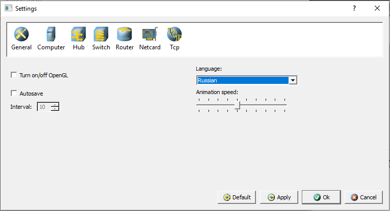
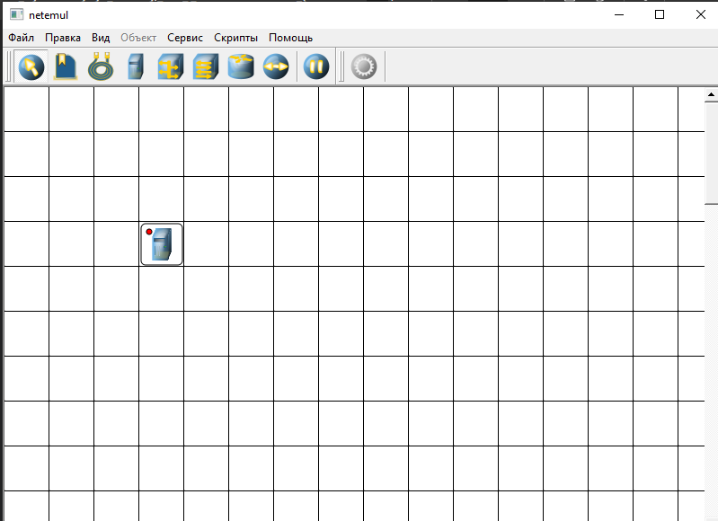
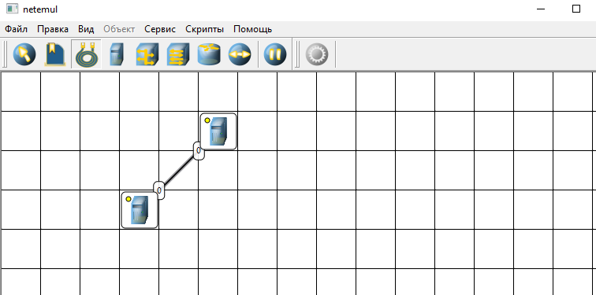
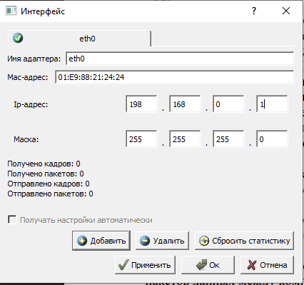
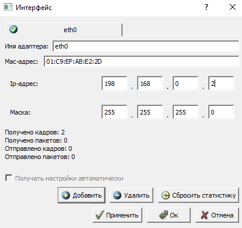
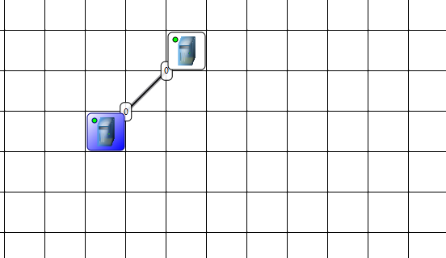
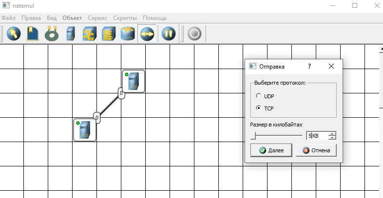
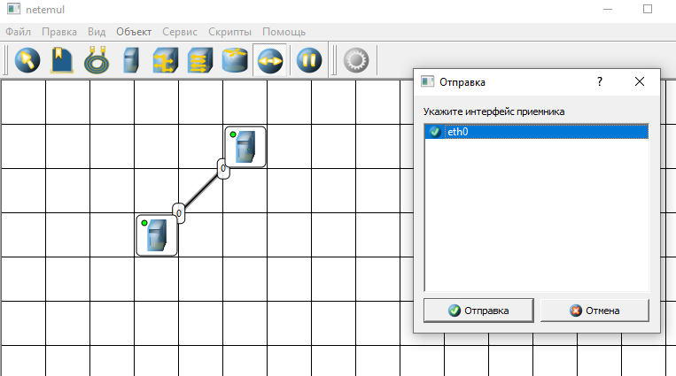
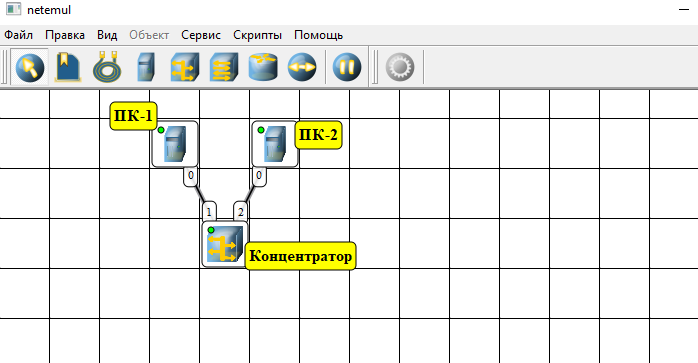
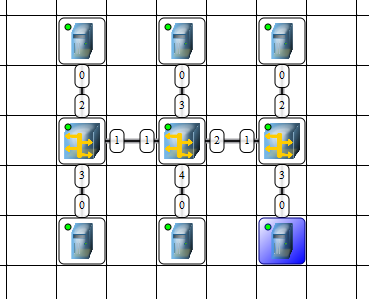

# Лабораторная работа №3 «Изучение программных средств для эмуляции компьютерных сетей»

Цель работы: приобретение знаний и практических навыков в использовании программного обеспечения для моделирования компьютерной сети.

Материалы, оборудование, программное обеспечение: лаборатория, оснащенная персональными компьютерами, объединенными в локальную сеть с доступом в Интернет, программа для моделирования компьютерных сетей Netemul.

Теоретическое введение
Практика в области сетевых технологий может проводиться как на реальном, так и на виртуальном оборудовании. В первом случае имеются явные преимущества, но требуются большие затраты на устройства и расходные материалы. Второй процесс менее затратный, но требует выбора программного обеспечения, наиболее полно удовлетворяющего требованиям для проектирования, мониторинга или анализа компьютерных сетей. Кроме того, данное программное обеспечение можно использовать, когда затруднено решение проблем на реальных сетях из-за риска нарушить их нормальное функционирование.
Существует два вида программ моделирования компьютерных сетей: симуляторы и эмуляторы.
Симулятор – программное обеспечение, которое имитирует топологию сети, состоящей из одного или нескольких сетевых устройств.
Моделируемые сетевые устройства не являются реальными устройствами и не могут передавать «живой» сетевой трафик. Сетевые устройства в симуляторе ограничены командами и функциями, запрограммированными в них. В имитируемых аналогах может отсутствовать ряд дополнительных возможностей, которые реализованы на реальных сетевых устройствах. Достоинство симуляторов заключается в том, что они, как правило, не требовательны к ресурсам.
Эмулятор – программное обеспечение, которое виртуализируют реальные сетевые устройства с большим набором функций по сравнению с устройствами, представленными в симуляторах. Виртуальные сетевые 33 устройства имитируют полнофункциональные устройства конкретных производителей (Cisco, HP, Huawai и др.).
Программные симуляторы и эмуляторы являются удобным и функциональным средством при проектировании и внедрении сетевых решений, обеспечивая выбор наиболее оптимального варианта моделирования.
Программа для моделирования компьютерных сетей NetEmul была создана для визуализации работы компьютерных сетей и облегчения понимания происходящих в ней процессов. Кроме обучения, программа открывает широкие возможности для экспериментов и их наглядного отображения.
NetEmul свободно распространяется по лицензии GPL, является кроссплатформенной и может функционировать в операционных системах: Windows, Linux, MacOS. Благодаря этому программа может быть полезна как в учебных заведениях, использующих свободное ПО, так и в домашних условиях.

Контрольные вопросы для самопроверки

• Какие виды программ используются для моделирования компьютерных
сетей?

Для моделирования компьютерных сетей используются: симуляторы событийного уровня (NS‑3, NS‑2, OMNeT++) для детального моделирования пакетов и протоколов; эмуляторы сетей (Mininet, GNS3, EVE‑NG) для запуска виртуальных хостов и образов реальных устройств; генераторы трафика и тестовые платформы (iperf/iperf3, Ostinato, TRex) для измерений пропускной способности и задержек; инструменты для моделирования канального и физического уровней и беспроводных сетей (модули Wi‑Fi/LTE в ns‑3, OMNeT++ с INET, QualNet/EXata); сетевые лабораторные и виртуальные стенды (Cisco Packet Tracer, Cisco VIRL/CM labs) для обучения и тестирования конфигураций; инструменты для анализа и визуализации трафика и топологий (Wireshark, NetSim, NetFlow/NetStream) для отладки и мониторинга; среды для SDN/NFV‑исследований (Mininet вместе с контроллерами OpenDaylight/ONOS, OpenStack/OSM для NFV). Рекомендации: для протокольных исследований — NS‑3 или OMNeT++; для тестирования конфигураций реальных устройств — GNS3/EVE‑NG или VIRL; для обучения — Packet Tracer или Mininet; для нагрузочного тестирования — TRex или iperf.

• Что такое IP-адрес?

IP‑адрес — это уникальный числовой идентификатор, присваиваемый каждому устройству в компьютерной сети, использующий протокол IP, для адресации и маршрутизации пакетов данных. Основные моменты: IPv4 — 32‑битный адрес, обычно записывается в десятичных октетах (например, 192.168.0.1); IPv6 — 128‑битный адрес в шестнадцатеричном формате (например, 2001:0db8::1) для расширения пространства адресов. IP‑адреса бывают статические (постоянные) и динамические (выдаются по DHCP), а также разделяются на публичные (доступны в интернете) и приватные (используются внутри локальных сетей). IP‑адрес служит для определения отправителя и получателя пакетов и участвует в принятии маршрутов между сетями.

• Что такое маска подсети?

Маска подсети — это 32‑битная (для IPv4) или 128‑битная (для IPv6 — обычно используют префиксную длину) битовая маска, которая определяет, какая часть IP‑адреса относится к сети (сетевой префикс), а какая — к узлу (хосту). По маске подсети маршрутизаторы и хосты вычисляют принадлежность адресов к одной сети и формируют таблицы маршрутизации.

• Как работает концентратор?

Концентратор (hub) — простое сетевое устройство уровня 1 (физический уровень OSI), которое объединяет несколько Ethernet‑портов и передаёт электрические/оптические сигналы без какой‑либо интеллектуальной обработки. Основные принципы работы:
1. Физическая ретрансляция: когда пакет (кадры Ethernet) приходит на один порт, концентратор ретранслирует тот же сигнал на все остальные порты одновременно.
2. Отсутствие коммутации/маршрутизации: концентратор не читает MAC‑адреса и не направляет трафик к конкретному получателю; он слепо широковещательно раздаёт сигнал.
3. Коллизии в сети: в общем сегменте с хабом все узлы делят одну коллизионную домен; при одновременной передачи происходит коллизия, что требует повторной отправки (CSMA/CD в полудуплексном Ethernet).
4. Полудуплекс vs полнодуплекс: большинство хабов поддерживают только полудуплекс; современные коммутаторы поддерживают полнодуплекс и избегают коллизий.
5. Пропускная способность: доступная пропускная способность делится между всеми активными портами; при интенсивном трафике эффективность низкая.
6. Простота и цена: хабы дешевы и не требуют настроек, но устарели для современных сетей из‑за проблем с производительностью и безопасностью (все пакеты видны всем узлам).
7. Применение сегодня: редко используются в современных Ethernet‑сетях; заменяются коммутаторами (switch), которые создают отдельные коллизионные домены для каждого порта и используют таблицы MAC для направленной передачи.

• Какие особенности обмена данными в ЛВС на основе концентраторов?

Особенности обмена данными в локальной вычислительной сети (ЛВС) на основе концентраторов (hubs):
1. Общий коллизионный домен: все узлы находятся в одном коллизионном домене; одновременные передачи вызывают коллизии, что требует повторной отправки (CSMA/CD).
2. Полудуплексная передача: типично работает в полудуплексном режиме — узел не может одновременно передавать и принимать; это увеличивает вероятность коллизий и задержек.
3. Широковещательная ретрансляция: входящий сигнал дублируется и отправляется на все порты, поэтому кадры доходят до всех узлов независимо от адресата.
4. Ограниченная пропускная способность: доступная полоса делится между всеми активными портами; при высоком трафике суммарная производительность заметно падает.
5. Отсутствие изоляции трафика: нет сегментации по MAC‑адресам, поэтому весь трафик видим всем устройствам — ухудшение безопасности и рост лишней загрузки (нецелевой трафик).
6. Задержки и неопределённость доставки: частые коллизии и ретрансляции увеличивают среднюю задержку и варьируемость (jitter).
7. Ограничения на длину и топологию: из‑за коллизий и времени распространения применимы строгие ограничения на длину кабельных сегментов и число повторителей/концентраторов в цепочке.
8. Нет управления потоком и приоритизации: концентратор не поддерживает QoS, приоритизацию или фильтрацию трафика.
9. Простота и дешевизна: лёгкая установка, не требует конфигурации — подходит только для очень простых/старых сетей или при тестовых задачах.
10. Диагностика усложнена: из‑за широковещательной природы труднее локализовать источник проблем по трафику.

### Задание 1. Изучение интерфейса программы

Приложение позволяет создавать сети без каких-либо ограничений. Верхняя панель инструментов содержит значки всех объектов, которые можно разместить в рабочей области. Выбор объекта и его размещение в сетке рабочей области выполняется стандартными манипуляциями с компьютерной мышью. Объектами могут быть компьютеры, концентраторы, коммутаторы, маршрутизаторы, соединительные кабели и текстовые поля для ввода надписи или комментария.
После выбора и размещения объектов выполняется настройка соединений, перетаскиванием линий от одного объекта к другому. Все необходимые для построения сети инструменты, а также кнопки Отправки сообщений и Запустить/Остановить размещены на Панели устройств. При корректном соединении устройств на каждом конце соединения показан номер используемого интерфейса, а на иконке устройства индикатор соединения меняет цвет с красного на желтый (соединение есть, но интерфейсы не настроены). На Панели параметров расположены свойства объектов. Для выделенного объекта появляются только те свойства, которые характерны для него. Настройку параметров работы конкретного узла можно выполнить в контекстном меню (нажатие правой кнопки мыши на значке узла).

### Задание 2. Непосредственное объединение в сеть двух компьютеров
Рассмотреть простейший случай организации сети из двух компьютеров без использования сетевого коммутационного оборудования.

### Задание 3. Моделирование сети из двух ПК и концентратора
1. Выполнить команду Файл-Новый, чтобы нарисовать схему сети как
показано на Рисунке 5.
2. Добавить на рабочее поле два компьютера и концентратор, соединить
устройства, как показано на Рисунке 5, настроить сетевые интерфейсы
компьютеров, задав IP-адреса и маски подсети, добавить рядом с
устройствами соответствующие надписи.
3. Проверить работоспособность смоделированной сети, передав пакеты
данных (TCP, 5KB) между компьютерами.
4. Проследить за перемещением пакетов и сделать выводы об
особенностях работы компьютерной сети с концентратором.

### Задание 4. Моделирование ЛВС на концентраторах
1. Выполнить команду Файл-Новый, чтобы нарисовать схему сети.
2. Добавить на рабочее поле шесть компьютеров, три концентратора и
соединить устройства как показано на рисунке 6.
3. Настроить сетевые интерфейсы компьютеров, задав IP-адреса и маски
подсети.
4. Проверить работоспособность смоделированной сети, передав пакеты
данных (TCP, 5KB) между компьютерами.
5. Проследить за перемещением пакетов и сделать выводы об
особенностях работы ЛВС на основе концентраторов.
6. Проекты сохранить для отчета.

