# Лабораторная работа № 4 Командная строка Windows

Цель работы: Развитие профессиональных навыков
работы в командной строке Windows.
Задачи работы:
– Создание структуры каталогов;
– Создание, просмотр, редактирование, удаление файлов;
– Удаление структуры каталогов;
– Манипулирование операционной системой Windows с
помощью командной строки.

Задание на лабораторную работу.

Загрузить командную строку (Пуск – Программы –
Стандартные – Командная строка).
1) В каталоге Temp создать дерево каталогов по
вариантам как показано в вариантах заданий с использованием команд табл. 1.

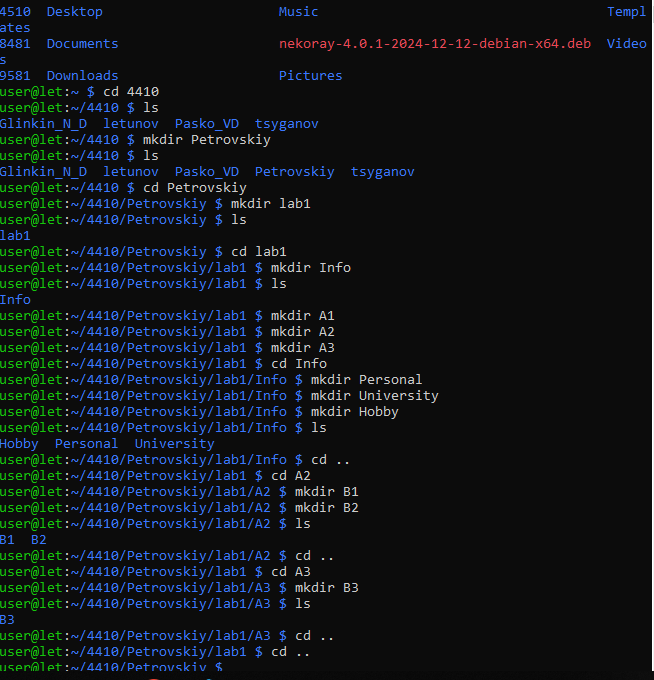

2) В каталоге А2 создать подкаталоги В4 и В5 и удалить каталог В2.

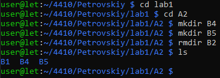

3) В каталоге Personal создать файл Name.txt,
содержащий информацию о фамилии, имени и отчестве
студента. Здесь же создать файл Date.txt, содержащий информацию о дате рождения студента. В этом же каталоге создать файл School.txt, содержащий информацию о школе, которую закончил студент.

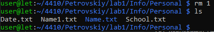

4) В каталоге University создать файл Name.txt,
содержащий информацию о названии вуза и специальность, на которой студент обучается. Здесь же создать файл Mark.txt с оценками на вступительных экзаменах и общей суммой баллов.

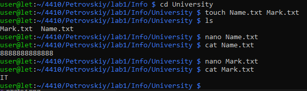

5) В каталоге Hobby создать файл hobby.txt с
информацией об увлечениях студента.

6) Скопировать файл hobby.txt в каталог А2 и
переименовать его в файл Lab_№варианта.txt.

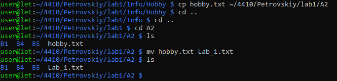

7) Сделать копию файла Lab_№варианта.txt (например, copy_Lab_№варианта.txt ) в этом же каталоге и удалить его.

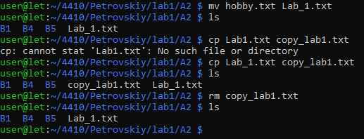

8) Очистить экран от служебных записей.

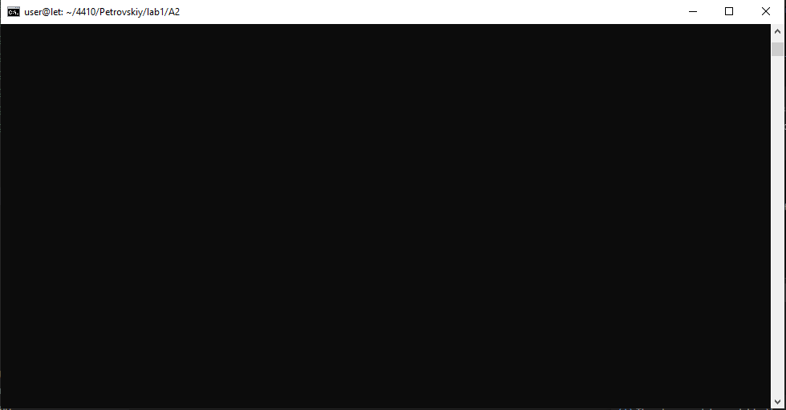

9) Вывести на экран поочередно информацию,
хранящуюся во всех файлах каталога Personal.

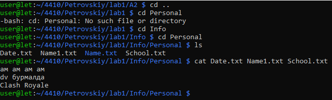

10) Отсортировать все файлы, хранящиеся в каталоге
Personal, по имени.

Не работает

11) Объединить все файлы, хранящиеся в каталоге
Personal, в файл all.txt и вывести его содержимое на экран.

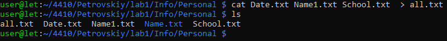

12) Отредактировать файл all.txt, добавив в него год вашего рождения, и вывести его содержимое на экран.

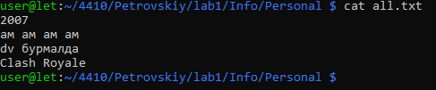

13) Скопировать файл all.txt в директорию А1.

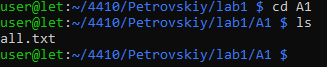

## Контрольные вопросы
1. Что такое командная строка?

Командная строка (CLI — Command Line Interface) — это текстовый интерфейс взаимодействия пользователя с операционной системой. Вместо использования мыши и графических элементов (иконок, окон), пользователь вводит текстовые команды с клавиатуры, которые интерпретируются системой и выполняются.

2. Перечислите основные команды управления
файлами в командной строке.

Создание папки: mkdir (в обеих ОС).
Переход в папку: cd.
Просмотр содержимого: dir (Windows), ls (Linux).
Копирование: copy (Windows), cp (Linux).Перемещение/Переименование: move (Windows), mv (Linux).
Удаление файла: del (Windows), rm (Linux).

3. Перечислите команды вывода основной
информации системы.

Windows:systeminfo — полные данные о системе.
ver — версия ОС.
tasklist — список запущенных процессов.

Linux:uname -a — информация о ядре.
df -h — информация о свободном месте на дисках.free -m — данные об оперативной памяти.

4. Перечислите команды ввода/вывода файлов.

Вывод (чтение) текста в консоль: type (Windows), cat (Linux).
Постраничный вывод: more или less.
Запись в файл (перенаправление): Оператор > (создает новый или перезаписывает) и >> (добавляет в конец).

5. Возможно ли полноценное управление системой,
пользуясь только командной строкой? Ответ обоснуйте.

Да, возможно.
Обоснование: Большинство серверных систем (особенно на базе Linux) работают вообще без графической оболочки (GUI). Через консоль можно управлять правами доступа, устанавливать ПО, настраивать сеть, управлять процессами и автоматизировать задачи с помощью скриптов. Это работает быстрее и потребляет меньше ресурсов системы, чем графический интерфейс.

6. Подумайте, чем отличается командная строка
Windows от командной строки MS-DOS, несмотря на их
схожесть в командах.

Архитектура: MS-DOS сама была операционной системой, которая управляла «железом». CMD в Windows — это эмулятор (приложение), работающее внутри современной многозадачной ОС (семейства NT)

Возможности: CMD поддерживает длинные имена файлов (в DOS было ограничение 8.3), работу с сетью, современную адресацию памяти и многопоточность, чего в MS-DOS не было.

Привилегии: В Windows CMD ограничена правами пользователя (нужен запуск от имени администратора), в DOS ограничений прав не существовало.

7. Приведите примеры интерпретаторов команд в
других операционных системах.

Bash (Bourne Again Shell) — стандарт для большинства дистрибутивов Linux и macOS.
Zsh (Z shell) — современная оболочка, ставшая стандартом в новых версиях macOS.
PowerShell — продвинутый интерпретатор от Microsoft (есть версии и для Linux), работающий с объектами, а не просто текстом.
Fish — дружелюбный интерпретатор с автодополнением и подсветкой «из коробки».
